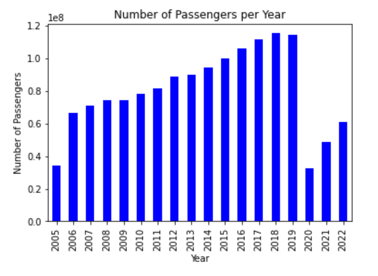
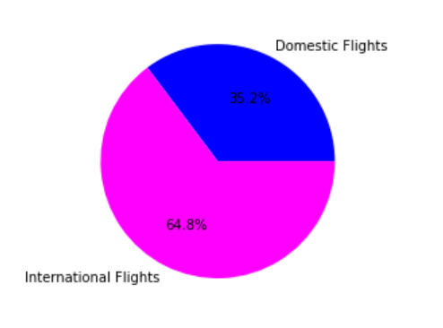
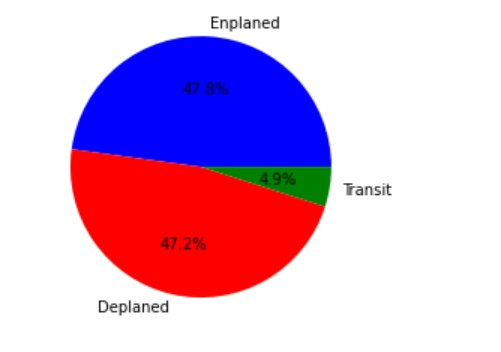

## Milestone 1 (7th April, 5pm)

**10% of the final grade**

This is a preliminary milestone to let you set up goals for your final project and assess the feasibility of your ideas.
Please, fill the following sections about your project.

*(max. 2000 characters per section)*

### Dataset

We have decided to examine the dataset which we got from following source: https://catalog.data.gov/dataset/air-traffic-passenger-statistics

It contains data about air traffic passenger statistics for all flights that depart from, arrive at or have transit at the San Francisco International Airport (SFO) from July 2005 until December 2022. As the dataset gets updated every 3 months, we are using the most current version, but in the future the dataset found at the given source might contain even more data.

Our dataset has 12 columns, being:
- Activity Period: consists of 6 digits, the first 4 digits being the year and the last 2 digits the month
- Operating Airline: the name of the operating airline
- Operating Airline IATA Code: the official IATA code of the operating airline
- Published Airline: the name of the published airline; in aviation the published airline can be different from the operating airline
- Published Airline IATA Code: the official IATA code of the published airline
- GEO Summary: describes if the described flight is a domestic or international flight; only these two values are possible
- GEO Region: describes the geographic region of departure/arrival (whichever is not the San Francisco International Airport); possible are 'Canada', 'US', 'Mexico', 'Europe', 'Asia', 'Australia / Oceania', 'Central America', 'Middle East'
- Activity Type Code: describes if the given flight acticity is a flight departing from San Francisco International Airport ('Enplaned'), arriving at it ('Deplaned') or having it as transit airport ('Thru / Transit')
- Price Category Code: describes if the flight is a low fare flight ('Low Fare') or not ('Other')
- Terminal: describes the terminal at the SFO airport from which the planes departs or at which it arrives
- Boarding Area: describes the boarding area at the given terminal from which the plane departs or at which it arrives
- Passenger Count: describes the total passenger count on the given flight in the given activity period

The quality of the data is very good as all 50730 tuples have information in all 12 columns. There is no general preprocessing needed, only preprocessing for specific tasks/ needs, for example as the tracking begins in July 2005, to compare the total passenger count for given years it is good to eliminate the data of 2005 and only use the data from 2006 to 2022 as these years have the data for the whole year.

### Problematic
The general topic of this visualization task will be to examine and showcase the trends of air travel originating from San Francisco International Airport, specifically analyzing patterns over time across different airlines and geographic destination regions. The main axis that we will develop is the change in passenger volume over time for different airlines and regions, and try to determine the factors that may be driving these changes.

The motivation for this visualization is to gain a better understanding of the factors that influence air travel demand and how they have evolved over time. By visualizing the data in an engaging and informative way, we can help the targeted audience gain insights into trends and patterns that may not be immediately apparent from the raw data.

For instance, the target audience is broad, ranging from airline industry professionals to travel enthusiasts and data analysts. The visualization should be accessible to a wide range of users, regardless of their level of expertise with data analysis or the airline industry. To accomplish this, we will use a variety of chart types and interactive features to make the data more engaging and approachable for users.

The main aim will be to study the main axis of change in passenger volume over time for different airlines and regions. For this purpose, we will create a visualization that shows the connection of flights departing from San Francisco with different regions of the world and their evolution over time.

One idea is to elaborate a heat map that displays the different regions of the world, color-coded based on the number of flights departing from San Francisco to each region. We will also include a time slider that allows users to explore the data over different time periods. As the user interacts with the time slider, the map will update to show how the number of flights departing from San Francisco to different regions has changed over time.

Another axis which we can explore is the creation of charts that provides additional information about each region, such as the number of passengers, the main operating airlines, and the average price wage. This will allow users to explore the data in more detail and gain insights into how different factors may be influencing the number of flights departing from San Francisco to different regions over time.

### Exploratory Data Analysis

We have done some basic pre-processing on our dataset using the panda library. Our notebook can be found [here](https://github.com/com-480-data-visualization/project-2023-datavizteam/blob/master/Pre_Processing/Milestone1_PreProcessing.ipynb). The first thing we did was to separate the "Activity Period" column into two separate columns "Year" and "Month" so it's easier to use. Here are some interesting facts about the dataset.
- There are 102 differents airlines operating at the San Francisco International Airport.
- The maximum number of passengers per month was attained by United Airlines in August 2013: 659'837 passengers.

Here are some plots that we've produced.

The first one is the number of passengers by year, we can clearly see the impact of COVID (2020) in the number of yearly passengers.

The second one shows the proportion of international and domestic flights.

The third one shows the proportion of enplaned (landed), deplaned (departed) and transit flights.

### Related work 

We haven't encountered many interesting visualizations but here are some links that we found interesting:
- https://www.kaggle.com/code/melikedilekci/airlines-traffic-passenger-statistics

Our approach is original because we aim to produce interactive maps and plots to allow the audience to visualize the data instead of just reading plots or tables.

Sources of inspiration:
- 

